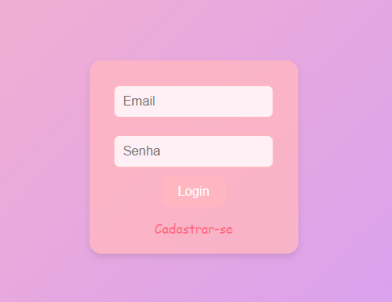
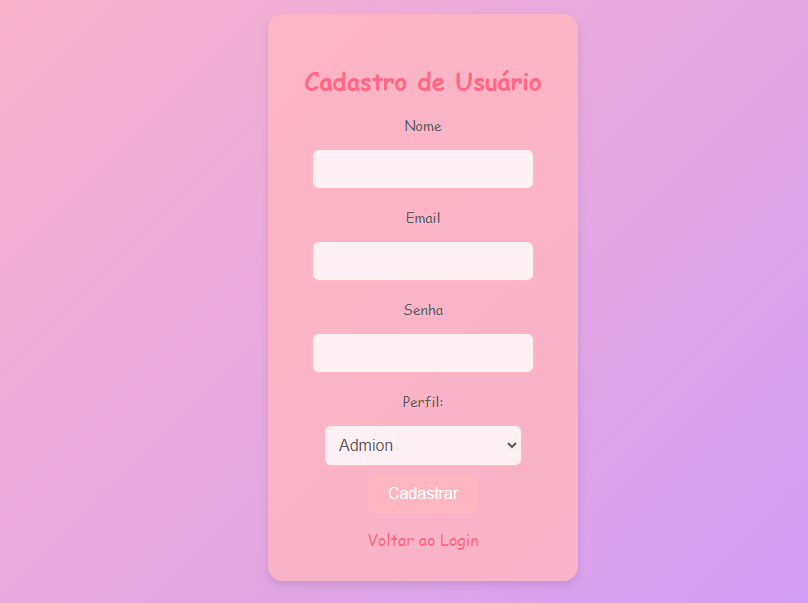

# CadLog_System

## Descrição do Projeto

O **CadLog_System** Este projeto é um sistema de gerenciamento de usuários com autenticação e diferentes perfis de acesso (Admin, Gestor, Colaborador). O sistema permite o cadastro de usuários, login, visualização de uma dashboard personalizada para cada perfil e a gestão de usuários conforme as permissões do perfil.

1. **Admin**: Tem acesso total ao sistema, podendo gerenciar usuários e configurações.
2. **Gestor**: Tem acesso intermediário, gerenciando parte dos dados e equipes.
3. **Colaborador**: Possui acesso limitado, podendo visualizar e interagir com partes específicas da aplicação.

O projeto está sendo desenvolvido com foco em usabilidade e acessibilidade, visando uma interface responsiva, com um design moderno e cores suaves.

## Estrutura do Projeto

- **AuthController.php**: Controla o processo de login e logout.
- **DashboardController.php**: Gerencia o acesso à dashboard, permitindo o acesso apenas para usuários autenticados.
- **UserController.php**: Controla o cadastro e a listagem de usuários.
- **database.php**: Implementa a conexão com o banco de dados usando o padrão Singleton.
- **user.php**: Model que contém as funções de manipulação de dados dos usuários no banco de dados.
- **Views (Front-end)**:
  - `login.php`: Página de login.
  - `register.php`: Página de cadastro de usuários.
  - `dashboard.php`: Página da dashboard, personalizada conforme o perfil do usuário.
  - `list_users.php`: Página que lista todos os usuários, com ações permitidas conforme o perfil.
  - `edit_user.php`: Página para edição de dados de um usuário.

## Funcionalidades

- **Login**: `/index.php?action=login`
  - Exibe a tela de login.
- **Logout**: `/index.php?action=logout`
  - Encerra a sessão do usuário e redireciona para a tela de login.
- **Cadastro de Usuário**: `/index.php?action=register`
  - Exibe a tela de cadastro de novos usuários.
- **Dashboard**: `/index.php?action=dashboard`
  - Exibe a dashboard personalizada com base no perfil do usuário.
- **Listagem de Usuários**: `/index.php?action=list`
  - Lista todos os usuários do sistema (disponível para Admin e Gestor).
- **Edição de Usuários**: `/index.php?action=edit&id={user_id}`
  - Permite editar os dados de um usuário específico (disponível para Admin e Gestor).

## Telas


### Campos da tela de Login:
  

```

<input type="email" name="email" placeholder="Email" required><br>
<input type="password" name="senha" placeholder="Senha" required><br>

```

### Campos da tela de Cadastro:


```

            <label for="nome">Nome</label>
            <input type="text" name="nome" id="nome" required>
            <label for="nome">Email</label>
            <input type="email" name="email" id="email" required>
            <label for="">Senha</label>
            <input type="password" name="senha" id="senha" required>
            <label for="perfil">Perfil:</label>  

```

### Campos da tela de Lista de Usuários


## Tecnologias utilizadas

- **GitHub**
- **Xampp**
- **PhpMyAdmin**
- **PHP**
- **CSS**
- **HTML**

# Conatato e agradecimento

Agradecemos a todos os desenvolvedores e colaboradores que estão apoiam o desenvolvimento deste projeto. Suas sugestões e contribuições são extremamente valiosas para a evolução contínua da aplicação.

Se você tiver dúvidas ou sugestões, entre em contato conosco:


 